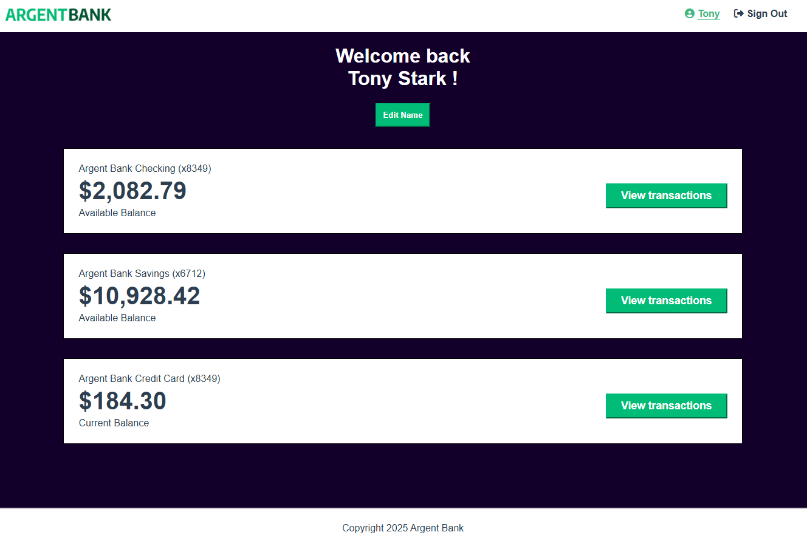

# Projet 13 - ArgentBank


Treizième projet de la formation OpenClassrooms : Développeur d'applications Javascript/React. <br /> <br />
Objectif :
- S'authentifier à une API
- Implémenter un gestionnaire d'état dans une application React
- Intéragir avec une API
- Modéliser une API

## Contexte
ArgentBank est une nouvelle banque fraichement débarquée sur le marché. <br />
L'objectif est d'implémenter la première partie du contrat, à savoir :
- L'authentification des utilisateurs.
- Les transactions (en état de réflexion)

## Installation

Les librairies intégrées au projet sont : <br />
\- SASS <br />
\- Typescript <br />
\- Eslint <br />
\- React-Router <br />
\- Redux <br />
\- Redux Toolkit<br />
<br />

Pour récupérer le projet, clonez directement ce repository puis faites un ``` npm install ```. <br />
Enfin, lancez la commande ```npm run dev```.

P.I : Le projet tourne sur node 18.18.0.

## BACK-END :
Pour faire tourner le serveur en local : <br />
https://github.com/OpenClassrooms-Student-Center/Project-10-Bank-API
<br />
PI : Le projet tourne sur node 12.22.12

## Demo


